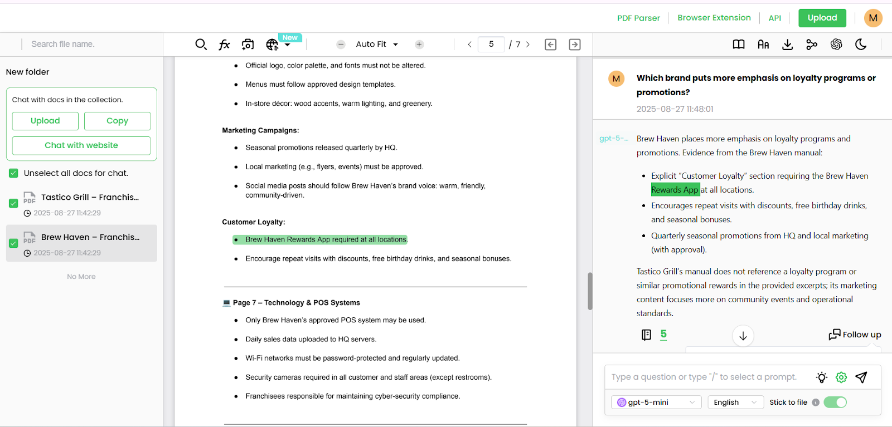

# 📄 AI-powered Document Processing Tool

**Agentic AI platform for legal and financial document review**  
This tool helps lawyers and finance teams quickly review and understand large documents. It finds key information, answers questions with proof, and generates summaries—cutting work time by **up to 90%**. Works seamlessly with existing systems while keeping data secure.

---

## 🔹 Scheme

---

## ⚙️ Technical Description

This platform combines **Legal BERT** and **GPT-4o** in a **Retrieval-Augmented Generation (RAG)** workflow:

- Extracts clauses and important sections
- Provides citation-backed answers to questions
- Drafts summaries efficiently
- Integrates with document management systems (DMS) securely
- Reduces research time by up to **87%**

---

## 🧩 Examples

<table>
    <tbody>
        <tr>
            <td>
                
            </td>
            <td>
                
            </td>
        </tr>
        <tr>
            <td>
                
            </td>
            <td>
                
            </td>
        </tr>
        <tr>
            <td>
                
            </td>
            <td>
                
            </td>
        </tr>
        <tr>
            <td>
                
            </td>
            <td>
                
            </td>
        </tr>
        <tr>
            <td>
                
            </td>
            <td>
                
            </td>
        </tr>
        <tr>
            <td>
                
            </td>
            <td>
                
            </td>
        </tr>
        <tr>
            <td>
                
            </td>
            <td>
                
            </td>
        </tr>
        <tr>
            <td>
                
            </td>
            <td></td>
        </tr>
    </tbody>
</table>

### 📄 PDF Examples

[📄 Brew Haven – Franchise Operations Manual](./src/Brew_Haven–Franchise_Operations_Manual.pdf)

[📄 Processing results-Brew Haven, Tastico](./src/Processing_results-Brew_Haven_Tastico.pdf)

[📄 Tastico Grill – Franchise Operations Manual](./src/Tastico_Grill–Franchise_Operations_Manual.pdf)

### 🎥 Video Examples

<table>
    <tbody>
        <tr>
            <td>
                <video src=" " controls preload>
                    Your browser does not support the video tag.
                </video>
            </td>
            <td>
                <video src=" " controls preload>
                    Your browser does not support the video tag.
                </video>
            </td>
        </tr>
        <tr>
            <td>
                <video src=" " controls preload>
                    Your browser does not support the video tag.
                </video>
            </td>
            <td></td>
        </tr>
    </tbody>
</table>

---

## 📖 Full Description

  
📖 Click to expand the Description

## Overview
An **agentic AI platform** designed for legal and financial document review.  
It combines **Legal-BERT** embeddings with **GPT-4o** in a Retrieval-Augmented Generation (RAG) workflow to:

- Extract clauses with high precision
- Answer questions with inline **citations**
- Draft summaries and redlines

This system cuts research time by **up to 87%**, delivering **high-accuracy, auditable outputs** for law firms, insurers, and corporate legal teams.

---

## Problem
Manual document review in law and finance is:
- Slow and **time-consuming**
- **Error-prone** and risky in compliance-heavy contexts
- Expensive due to reliance on expert hours
- Limited by outdated search systems in long PDFs and precedents

Teams waste countless hours on clause extraction, cross-referencing, and summarization—while still risking missed obligations or outdated guidance.

---

## Solution & Impact
The platform orchestrates a **retrieval-augmented generation (RAG)** pipeline:
- **Legal-BERT embeddings** locate the most relevant passages across millions of documents
- **GPT-4o** synthesizes precise, **citation-backed answers**, drafts, or redlines
- The agent autonomously re-queries, validates, or escalates for quality control

**Impact:**
- Review cycles shrink from *days to minutes*
- Confidence is boosted through **verifiable sources**
- Outputs are **audit-ready** and securely integrated

---

## Key Achievements
- ⏱ **87% reduction** in review time during due-diligence pilots
- ✅ **94% factual-precision score** (against senior associate benchmarks)
- 🔗 **Inline citations** with hyperlinks for transparency
- 📂 Seamless DMS/SharePoint integration (via REST API + Azure AD SSO)
- 🔒 SOC 2 Type II–ready with encryption-at-rest and RBAC

---

## Process

### 1. Data Collection & Corpus Development
- Sources: SEC filings, EU directives, court rulings, anonymized contracts, insurance policies, compliance frameworks
- Scale: **25M+ clauses** across diverse legal & financial domains
- PII anonymized to preserve compliance

### 2. Preprocessing & Structuring
- OCR (Tesseract + LayoutLMv3) for scanned docs
- **Clause-level chunking** (~400 tokens, with overlap)
- Normalization of dates, money, references
- Taxonomy: **120+ clause categories** annotated

### 3. Embedding Model (Legal-BERT Fine-Tuning)
- Benchmarked against Sentence-BERT, MiniLM
- Fine-tuned on **12M labeled clauses**
- Used **triplet loss + synthetic augmentation**
- Achieved **>94% retrieval recall**

### 4. Retrieval & Indexing
- **FAISS (IVF-PQ)** vector store for **50M+ vectors**
- Hybrid retrieval (dense + BM25)
- Agentic reranker filters noise for **sub-second queries**

### 5. Generation, Validation & Guardrails
- GPT-4o answers grounded in retrieved text
- Mandatory **citations with hyperlinks**
- Automatic claim verification
- **Adversarial red-teaming** to test manipulation resistance
- Human-in-the-loop QA on 2,000+ samples

### 6. Evaluation & Continuous Learning
- Automated metrics:
    - F1-score for clause detection: **0.91**
    - Latency: **1.4s/query avg.**
- Expert review: 15 senior lawyers benchmarked accuracy/compliance
- Continuous retraining with partner data

---

## Outcomes
- **87% faster** legal due diligence reviews
- **94% factual precision** validated
- **50M+ document chunks indexed** with sub-second response
- **Full auditability** with inline, clickable citations

---

## Technologies Used
- **Legal-BERT** (domain embeddings)
- **GPT-4o** (reasoning in RAG loop)
- **FAISS**, **LangChain**, **Azure Functions**
- **Docker + Kubernetes**, **Terraform/IaC**
- Secure cloud deploys with **RBAC + SOC2 compliance**

---

## End Use Cases
- Contract clause extraction, comparison & risk flagging
- Litigation discovery search (with cited answers)
- Regulatory compliance checks (GDPR, HIPAA, AML)
- Summaries, briefs & press releases from evidence sets
- Internal knowledge-base assistants for legal & financial teams

---

## References
- [Chalkidis et al., 2020 – Legal-BERT](https://arxiv.org/abs/2010.02559)
- [Devlin et al., 2019 – BERT](https://arxiv.org/abs/1810.04805)
- [Raffel et al., 2020 – T5](https://arxiv.org/abs/1910.10683)
- [Johnson et al., 2019 – FAISS](https://arxiv.org/abs/1702.08734)
- [Lewis et al., 2020 – Retrieval-Augmented Generation](https://arxiv.org/abs/2005.11401)
- [Wolf et al., 2020 – Transformers](https://arxiv.org/abs/1910.03771)
- [US DOJ, 2020 – Compliance Guidance](https://www.justice.gov/criminal-fraud/page/file/937501/download)
- [EU FRA – GDPR Handbook](https://fra.europa.eu/en/publication/2018/handbook-european-data-protection-law)

